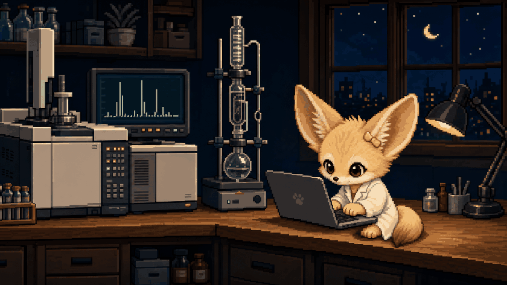

# CHEMDEV.AI

### Chemistry-domain Data Scientist

 

  

`toxicity prediction` · `cheminformatics` · `production systems`

 

  
  
  
  
  
  

---

## About

I studied **toxicity prediction for AI-driven drug discovery** and now work as a **chemistry-domain Data Scientist**.

I enjoy building **AI-powered services end to end**—from framing the problem and preparing data to modeling, APIs, deployment, and operation.

 

---

## Technical Stack

 

**Python · SQL · PyTorch · scikit-learn · RDKit · FastAPI · Docker**

 

---

## Latest Writing

ONE LATEST ARTICLE FROM EACH CHANNEL

 

### Blog

<!-- BLOG-POST-LIST:START -->

<a href="https://dukduk12.github.io/cheminformatics/rdkit-cheatsheet/"><strong>[Cheminformatics] RDKit Cheat Sheet: From SMILES and InChI to 3D, Descriptors, and Reactions</strong></a>

<!-- BLOG-POST-LIST:END -->

<a href="https://dukduk12.github.io/posts/">VIEW ALL POSTS →</a>

  

### Medium

<!-- MEDIUM-POST-LIST:START -->

<a href="https://medium.com/@sallyinner59/review-active-code-learning-benchmarking-sample-efficient-training-of-code-models-e472a4364f31?source=rss-4cc8da1abb9d------2"><strong>[Review] Active Code Learning : Benchmarking Sample-Efficient Training of Code Models</strong></a> 2026.07.18

<!-- MEDIUM-POST-LIST:END -->

<a href="https://medium.com/@sallyinner59">VIEW ALL STORIES →</a>

 

---

## Languages

GENERATED FROM PUBLIC REPOSITORIES VIA THE GITHUB API · UPDATED EVERY 6 HOURS

 

<!-- LANGUAGE-STATS:START -->
<pre>
Jupyter Notebook    ■■■■■■■■■■■■■□□□□□□□   63.0%
Python              ■■■■□□□□□□□□□□□□□□□□   21.1%
JavaScript          ■□□□□□□□□□□□□□□□□□□□    7.4%
SCSS                ■□□□□□□□□□□□□□□□□□□□    4.4%
Java                ■□□□□□□□□□□□□□□□□□□□    2.3%
HTML                ■□□□□□□□□□□□□□□□□□□□    1.5%
</pre>
<!-- LANGUAGE-STATS:END -->

 

---

## GitHub Overview

GENERATED FROM GITHUB API · UPDATED EVERY 6 HOURS

 

<!-- GITHUB-OVERVIEW:START -->
<pre>
Days on GitHub      ····················     422
Commits This Year   ····················     166
Current Streak      ■■■■■■■■■■■■■■■■■■■■   20 days
Longest Streak      ■■■■■■■■■■■■■■■■■■■■   20 days
Public Repos        ····················      27
Private Repos       ····················       0
</pre>
<!-- GITHUB-OVERVIEW:END -->

 

---

CHEMDEV.AI · DATA INTO DECISIONS

