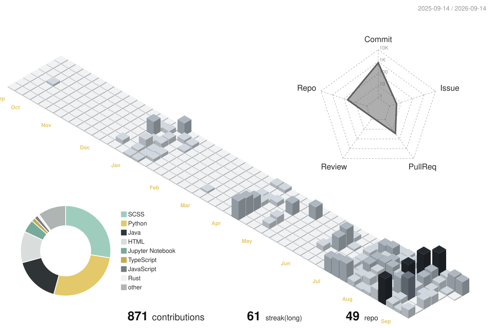

# CHEMDEV.AI

### Chemistry-domain Data Scientist

 

  

`toxicity prediction` · `cheminformatics` · `production systems`

 

  
  
  

---

## About

I studied **toxicity prediction for AI-driven drug discovery** and now work as a **chemistry-domain Data Scientist**.

I enjoy building **AI-powered services end to end**—from framing the problem and preparing data to modeling, APIs, deployment, and operation.

 

---

## Technical Stack

 

**Python · SQL · PyTorch · scikit-learn · RDKit · FastAPI · Docker**

 

---

## 3D Contribution Garden

A YEAR OF BUILDING, GROWING ONE COMMIT AT A TIME

 

 

---

## Languages

GENERATED FROM PUBLIC REPOSITORIES VIA THE GITHUB API · UPDATED EVERY 6 HOURS

 

<!-- LANGUAGE-STATS:START -->
<pre>
Jupyter Notebook    ■■■■■■■■■■■□□□□□□□□□   52.5%
Python              ■■■■■■□□□□□□□□□□□□□□   28.2%
JavaScript          ■■□□□□□□□□□□□□□□□□□□    8.3%
SCSS                ■□□□□□□□□□□□□□□□□□□□    6.2%
HTML                ■□□□□□□□□□□□□□□□□□□□    2.4%
Java                ■□□□□□□□□□□□□□□□□□□□    1.9%
</pre>
<!-- LANGUAGE-STATS:END -->

 

---

## GitHub Overview

GENERATED FROM GITHUB API · UPDATED EVERY 6 HOURS

 

<!-- GITHUB-OVERVIEW:START -->
<pre>
Days on GitHub      ····················     452
Commits This Year   ····················     430
Current Streak      ■■■■■■■■■■■■■■■■■■■■   50 days
Longest Streak      ■■■■■■■■■■■■■■■■■■■■   50 days
Public Repos        ····················      28
Private Repos       ····················      14
</pre>
<!-- GITHUB-OVERVIEW:END -->

 

---

CHEMDEV.AI · DATA INTO DECISIONS

